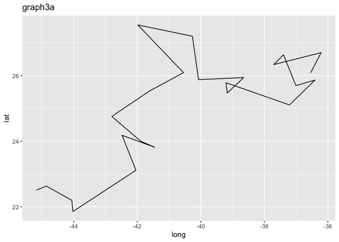
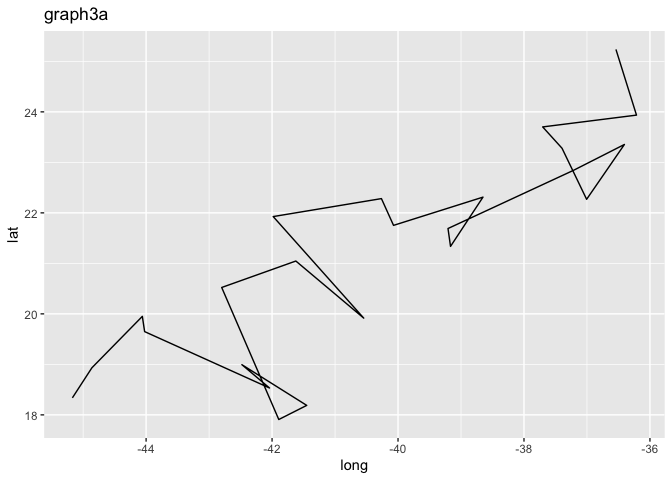
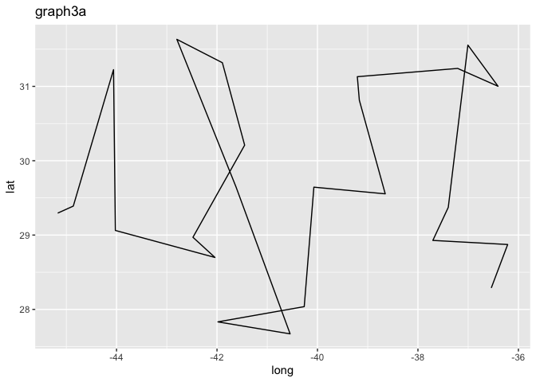
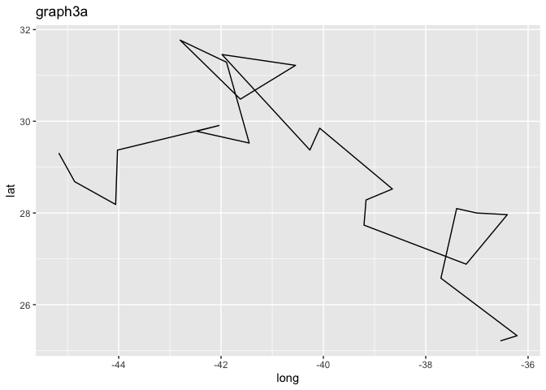
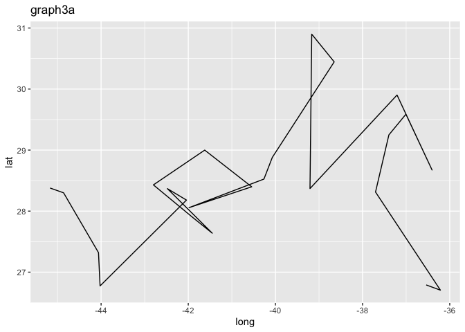
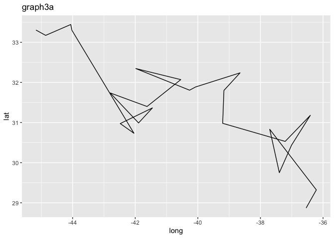
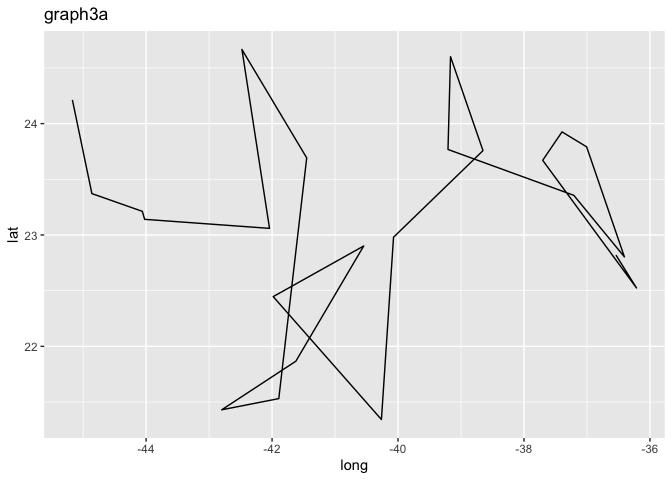
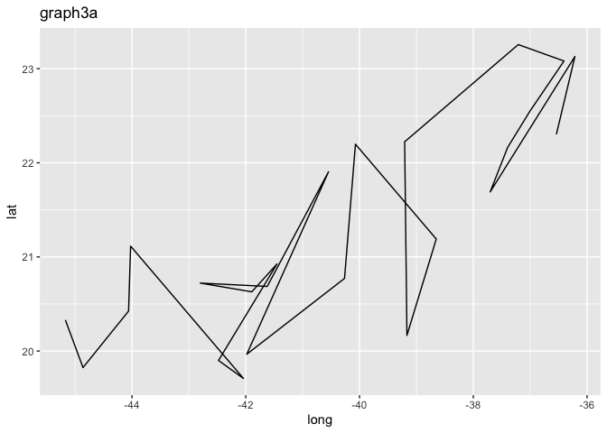
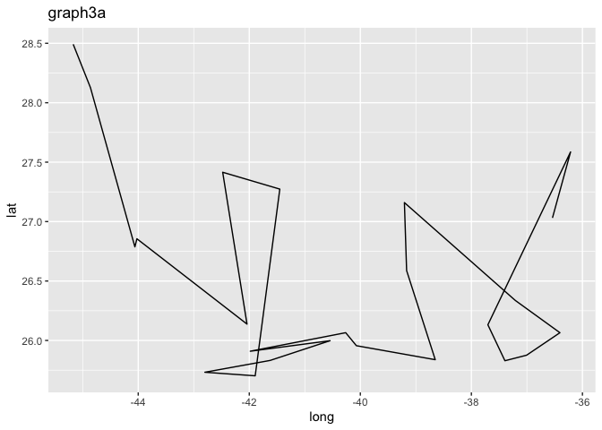
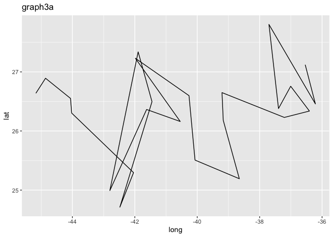

Week 13 Assignment
================
Ellen Bledsoe
2025-05-06

# Assignment

### Purpose

The goal of this assignment is to practice writing and using for loops
for iteration.

### Task

Write R code to successfully answer each question below.

### Criteria for Success

- Code is within the provided code chunks or new code chunks are created
  where necessary
- Code chunks run without errors
- Code chunks have brief comments indicating which code is answering
  which part of the question
- Code will be assessed as follows:
  - Produces the correct answer using the requested approach: 100%
  - Generally uses the right approach, but a minor mistake results in an
    incorrect answer: 90%
  - Attempts to solve the problem and makes some progress using the core
    concept, but returns the wrong answer and does not demonstrate
    comfort with the core concept: 50%
  - Answer demonstrates a lack of understanding of the core concept: 0%
- Any questions requiring written answers are answered with sufficient
  detail

### Due Date

April 29 before class

# Assignment Exercises

### Set Up

Be sure to load the `tidyverse` to use later in the assignment.

### 1. For Loop Basics (30 pts)

Complete the following tasks.

I recommend copying the commented code and making changes to the copy.
That way, if you have made edits that you haven’t kept track of, you
have the original code to start over as needed.

1.  The code below prints the numbers 1 through 5 one line at a time.
    Modify it to print each of these numbers multiplied by 3.

``` r
numbers <- c(1, 2, 3, 4, 5)
# for (number in numbers){
#   print(number)
# }

for(number in numbers){
  q1a <- 3 * number
  print(q1a)
}
```

    ## [1] 3
    ## [1] 6
    ## [1] 9
    ## [1] 12
    ## [1] 15

2.  Write a for loop that loops over the following vector and prints out
    the mass in kilograms (`mass_kg = 2.2 * mass_lb`)

``` r
mass_lbs <- c(2.2, 3.5, 9.6, 1.2)

for(mass_lb in mass_lbs){
  mass_kg = 2.2 * mass_lb
  print(mass_kg)
}
```

    ## [1] 4.84
    ## [1] 7.7
    ## [1] 21.12
    ## [1] 2.64

3.  Complete the code below so that it prints out the name of each bird
    one line at a time.

``` r
# birds = c('robin', 'woodpecker', 'blue jay', 'sparrow')
# for (i in 1:length(_________)){
#   print(birds[__])
# }
birds = c('robin', 'woodpecker', 'blue jay', 'sparrow')
for (i in 1:length(birds)) {
  print(birds[i])
}
```

    ## [1] "robin"
    ## [1] "woodpecker"
    ## [1] "blue jay"
    ## [1] "sparrow"

4.  Complete the code below so that it stores one area for each radius.

``` r
radius <- c(1.3, 2.1, 3.5)
# areas <- vector(_____ = "numeric", length = ______)
# for (__ in 1:length(________)){
#   areas[__] <- pi * radius[i] ^ 2
# }

areas <- vector(mode = "numeric", length = length(radius))
for (i in 1:length(radius)){
  areas[i] <- pi * radius[i]^2
}
areas
```

    ## [1]  5.309292 13.854424 38.484510

5.  Complete the code below to calculate an area for each pair of
    `lengths` and `widths`, store the areas in a vector, and after they
    are all calculated print them out:

``` r
lengths = c(1.1, 2.2, 1.6)
widths = c(3.5, 2.4, 2.8)
# areas <- vector(length = __________)
# for (i in _____) {
#   areas[__] <- lengths[__] * widths[__]
# }
areas
```

    ## [1]  5.309292 13.854424 38.484510

``` r
areas <- vector(length = length(lengths))
for (i in 1:length(lengths)) {
  areas[i] <- lengths[i] * widths[i]
}
```

### 2. Size Estimates by Name (30 pts)

This is a follow-up to “Size Estimates by Name” from last week.

Download the `dinosaur_lengths.csv` file from D2L and place it in the
correct directory. Read the file into R.

Write a function `mass_from_length()` that uses the equation
`mass <- a * length^b` to estimate the size of a dinosaur from its
length. This function should take two arguments, `length` and `species`.
For each of the following inputs for `species`, so use the associated
`a` and `b` values to estimate the species mass using these equations:

- *Stegosauria*: `mass = 10.95 * length ^ 2.64` ([Seebacher
  2001](http://www.jstor.org/stable/4524171)).
- *Theropoda*: `mass = 0.73 * length ^ 3.63` ([Seebacher
  2001](http://www.jstor.org/stable/4524171)).
- *Sauropoda*: `mass = 214.44 * length ^ 1.46` ([Seebacher
  2001](http://www.jstor.org/stable/4524171)).
- For any other value of `species`: `mass = 25.37 * length ^ 2.49`

1.  Use this function and a for loop to calculate the estimated mass for
    each dinosaur, store the masses in a vector, and after all of the
    calculations are complete show the first few items in the vector
    using `head()`.

2.  Add the results in the vector back to the original data frame. Show
    the first few rows of the data frame using `head()`.

3.  Calculate the mean mass for each `species` using `dplyr` (no `for`
    loops).

    ``` r
    dinosaur <- read.csv("dinosaur_lengths.csv")

    #a
    mass_from_length <- function(length, species){
      mass <- a * length^b
    }

    mass_from_length <- function(length, species){
      if (species == "Stegosauria"){
        mass = 10.95 * length ^ 2.64
      }else if (species == "Theropoda"){
        mass = 0.73 * length ^ 3.63
      }else if (species == "Sauropoda"){
        mass = 214.44 * length ^ 1.46
      }else{
        mass = 25.37 * length ^ 2.49
      }
      return(mass)
    }
    ```

### 3. Multi-file Analysis (20 pts)

You have satellite collars on a number of different individuals and want
to be able to quickly look at all of their recent movements at once. The
data is posted daily to a URL that contains one csv file for each
individual: [zip
file](http://www.datacarpentry.org/semester-biology/data/individual_collar_data.zip)

Start your solution by:

- Download `individual_collar_data.zip` from the link above and place
  the zip file in the correct directory.

- Unzip it using `unzip()`

- Obtain a list of all of the files with file names matching the pattern
  `"collar-data-.*.txt"` (using `list.files()`)

  ``` r
  unzip("../")
  unzip(zipfile = "individual_collar_data.zip", #path and name of folder
        exdir = "../Week13_Assignment_files/")

  list.files()
  ```

      ##  [1] "collar-data-A1-2016-02-26.txt"  "collar-data-B2-2016-02-26.txt" 
      ##  [3] "collar-data-C3-2016-02-26.txt"  "collar-data-D4-2016-02-26.txt" 
      ##  [5] "collar-data-E5-2016-02-26.txt"  "collar-data-F6-2016-02-26.txt" 
      ##  [7] "collar-data-G7-2016-02-26.txt"  "collar-data-H8-2016-02-26.txt" 
      ##  [9] "collar-data-I9-2016-02-26.txt"  "collar-data-J10-2016-02-26.txt"
      ## [11] "data_raw"                       "dinosaur_lengths.csv"          
      ## [13] "individual_collar_data"         "individual_collar_data.zip"    
      ## [15] "locations-2016-01-01.txt"       "locations-2016-01-02.txt"      
      ## [17] "locations-2016-01-03.txt"       "locations-2016-01-04.txt"      
      ## [19] "locations-2016-01-05.txt"       "locations.zip"                 
      ## [21] "Week13_Assignment_files"        "Week13_Assignment.Rmd"         
      ## [23] "Week13_Iteration.Rmd"

  ``` r
  collar_data <- list.files(path = "../Week13_Assignment_files/individual_collar_data/", pattern = "collar-data-.*.txt")
  ```

1.  Use a loop to load each of these files into R and make a line plot
    (using `geom_path()`) for each file with `long` on the `x` axis and
    `lat` on the `y` axis.

    Graphs, like other types of output, won’t display inside a loop
    unless you explicitly display them, so you need put your `ggplot()`
    command inside a `print()` statement.

    Include the name of the file in the graph as the graph title using
    the `ggtitle()`.

2.  Add code to the loop to calculate the minimum and maximum latitude
    in the file, and store these values, along with the name of the
    file, in a data frame.

    Show the data frame as output.

    ``` r
    #a
    Acollar_data <- length(collar_data)
    df3a <- vector(mode = "numeric", length = length(collar_data))
    library(ggplot2)
    for (i in 1:Acollar_data) {
      collardata <- collar_data[i]
      a3data <- read.csv(paste0("../Week13_Assignment_files/", collardata))
      collar_data_plot <- ggplot(a3data, aes(x = long, y = lat))+
      geom_path()+
      ggtitle("graph3a")
    print(collar_data_plot)
    }
    ```

    <!-- --><!-- --><!-- --><!-- --><!-- --><!-- --><!-- --><!-- --><!-- --><!-- -->

    ``` r
    #b
    for (i in 1:Acollar_data) {
      collardata <- collar_data[i]
      a3data <- read.csv(paste0("../Week13_Assignment_files/", collardata))
      collar_data_plot <- ggplot(a3data, aes(x = long, y = lat))+
      geom_path()+
      ggtitle("graph3a")
      b3data <- data.frame(file_name = character(Acollar_data),
                          max_lat = numeric(Acollar_data),
                          min_lat = numeric(Acollar_data))
    print(collar_data_plot)
    }
    ```

    <!-- --><!-- --><!-- --><!-- --><!-- --><!-- --><!-- --><!-- --><!-- --><!-- -->

### 4. DNA or RNA (20 pts)

This question has you write a function and then use the function in
various forms of iteration.

1.  Write a function that determines if a sequence of base pairs is DNA,
    RNA, or if it is not possible to tell given the sequence provided.
    RNA has the base Uracil (“u”) instead of the base Thymine (“t”), so
    sequences with u’s are RNA, sequences with t’s are DNA, and
    sequences with neither are unknown.

    ``` r
    library(tidyverse)
    dna_or_rna <- function(sequence){
      if (str_detect(sequence, "u")) {
        output = "RNA"
      }else if (str_detect(sequence, "t")) {
        output = "DNA"
      }else{
        output = "UNKNOWN"
      }
      return(output)
    }
    ```

Name the function `dna_or_rna()` and have it take sequence as an
argument. Have the function return one of three outputs: “DNA”, “RNA”,
or “UNKNOWN”.

*HINT: Remember our work with character strings and the `stringr`
package from the `tidyverse` (Week 7)?*

2.  Use the function to determine the sequence type for the following
    sequences.

``` r
seq1 <- "ttgaatgccttacaactgatcattacacaggcggcatgaagcaaaaatatactgtgaaccaatgcaggcg"
seq2 <- "gauuauuccccacaaagggagugggauuaggagcugcaucauuuacaagagcagaauguuucaaaugcau"
seq3 <- "gaaagcaagaaaaggcaggcgaggaagggaagaagggggggaaacc"
```

``` r
dna_or_rna(seq1)
```

    ## [1] "DNA"

``` r
dna_or_rna(seq2)
```

    ## [1] "RNA"

``` r
dna_or_rna(seq3)
```

    ## [1] "UNKNOWN"

Before tackling the next questions (c-f), run the following code chunk
to create a vector called sequences.

``` r
sequences <- c("ttgaatgccttacaactgatcattacacaggcggcatgaagcaaaaatatactgtgaaccaatgcaggcg",
              "gauuauuccccacaaagggagugggauuaggagcugcaucauuuacaagagcagaauguuucaaaugcau",
              "gaaagcaagaaaaggcaggcgaggaagggaagaagggggggaaacc",
              "guuuccuacaguauuugaugagaaugagaguuuacuccuggaagauaauauuagaauguuuacaacugcaccugaucagguggauaaggaagaugaagacu",
              "gauaaggaagaugaagacuuucaggaaucuaauaaaaugcacuccaugaauggauucauguaugggaaucagccggguc")
```

3.  Use the function you wrote and a `for` loop to create a vector of
    sequence types for the values in sequences

    ``` r
    dna_or_rna_4c <- vector(length = length(sequences))

    for (i in 1:length(sequences)) {
      dna_or_rna_4c[i] <- dna_or_rna(sequences[i])
    }
    ```

4.  Use the function and a `for` loop to create a data frame that
    includes a column of sequences and a column of their types.

    ``` r
    data4d <- data.frame(sequences = character(length(sequences)),
                         types = character(length(sequences)))


    for(i in 1:length(sequences)){
      data4d$sequences[i] <- sequences[i]
      data4d$types[i] <- dna_or_rna(sequences[i])
      print(i)
    }
    ```

        ## [1] 1
        ## [1] 2
        ## [1] 3
        ## [1] 4
        ## [1] 5

5.  OPTIONAL: Use the function and `sapply` to create a vector of
    sequence types for the values in sequences

6.  OPTIONAL: Use the function, and `mutate()` to create a data frame
    that includes a column of sequences and a column of their types.
    First, run the following line of code to turn the sequence vector
    into a dataframe.

``` r
seq_df <- as.data.frame(sequences)
```
